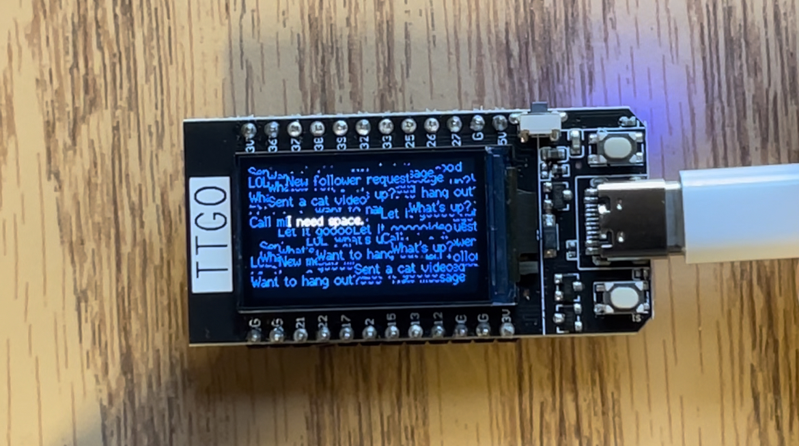

# Generative Art Project
author: Daniela Hikari Yano

## Overview:
This github directory cointains the source code used for the Generative Art Installation. 
The code is written in C++ and was transferred to the ESP32 TTGO T-display from the laptop, using the Arduino IDE and a type C cable.

The code shows at the center of the screen the message: "I am lonely." in white.
Right after, random notifications and messages in blue start to pop up at random locations. The messages and notifications are radnomly selected from a list. 
After filling out the screen, the following phrase appears: "I need space."
This code continues in a loop, but the messages are always selected in a random order.  

## Hardware:
- ESP32 TTGO T-display

