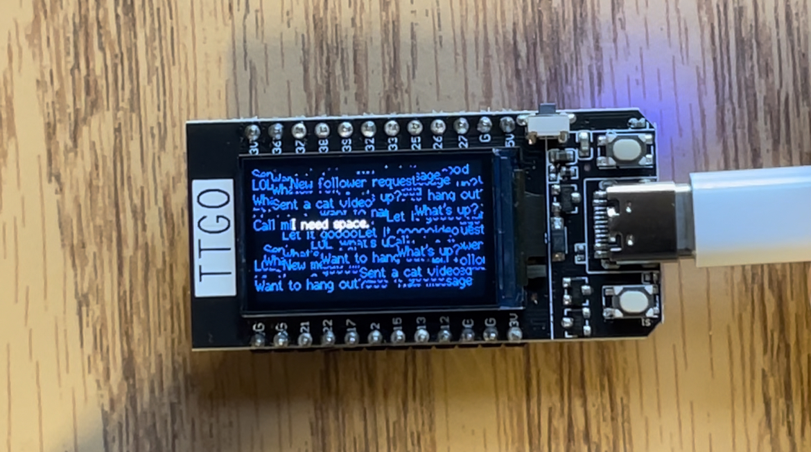

# Generative Art Project
author: Daniela Hikari Yano 

creative details at: https://danielahyano.github.io/generative_art.html

## Overview:
This github directory contains the source code used for the Generative Art Installation. 
The code is written in C++ and was transferred to the ESP32 TTGO T-display from the laptop, using the Arduino IDE and a type C cable.

The code shows at the center of the screen the message: "I am lonely." in white.
Right after, random notifications and messages in blue start to pop up at random locations. The messages and notifications are radnomly selected from a list. 
After filling out the screen, the following phrase appears: "I need space."
This code continues in a loop, but the messages are always selected in a random order.  

## Hardware:
- ESP32 TTGO T-display

- DC Power Supply

- Platform with type C connectors that is connected to the DC Power Supply

## Set up 

The Arduino IDE can be downloaded in (https://www.arduino.cc/en/software). 

After downloading the Arduino IDE, you can follow the instructions in https://www.youtube.com/watch?v=adLUgmCJKnM (a video made by our professor) to do the setup. 

If you are on a MacBook, you may need to install: https://github.com/Xinyuan-LilyGO/LilyGo-T-Call-SIM800/issues/139#issuecomment-90439071. 

After this, you can get the code from generative_art.ino and transfer it to the ESP32 using a type C cable connected from the notebook to the device (pressing the '->' in the top left of the screen. 

